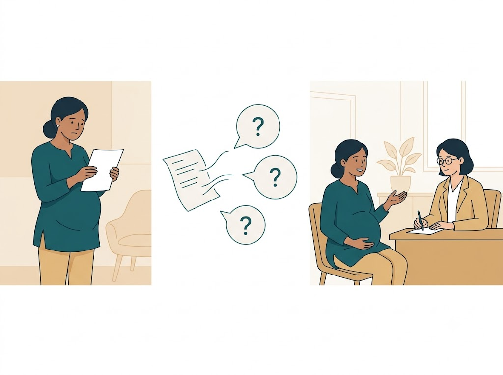

# MotherWell (Amma Care)

**A pregnant woman enters her blood report. Sixty seconds later she has three questions to ask her doctor — in her own language.**

Two agents on **Microsoft Foundry** (gpt-5.4), one deterministic Python tool, deployed as a traced
workflow. Built for the Founderz × Microsoft Agent Architect hackathon, September 2026.

[](https://github.com/sprasadgdev/motherwell/actions/workflows/tests.yml)

### Check it yourself in one minute

No Azure account, no API key and no model are needed to verify the part that matters, because
every clinical range lives in plain Python.

```bash
python amma_tool.py            # the tool alone, no AI involved
python -m pytest -q tests      # 59 tests: every range, boundary, unit and bad input
```

`amma_tool.py` imports nothing from any AI library, and one of the tests asserts exactly that.

---

## Why this matters

| | |
| --- | --- |
| Pregnant women anaemic, worldwide | **35.5%** (WHO, 2023 estimate) |
| **India** — largest absolute burden | **52.2%, and rising** (was 50.4%) |
| **Bihar** — worst state in India | **63.1%** |
| Also above 60% | Gujarat · West Bengal · Odisha · Tripura |
| **Mali** — worst country | **~59%** |
| Sub-Saharan Africa | **57%** |
| Developed countries, for contrast | **8–23%** |
| WHO target to halve anaemia by 2025 | **missed — deadline moved to 2030** |
| Cost of the treatment at week 24 | **iron tablets and food** |

The world set a target to halve this and missed it. Among **all women aged 15 to 49** the figure
**rose**. Among pregnant women it fell only slightly, from about 41% in 2000 to 35.5% in 2023,
nowhere near half. WHO reports only 18 countries are making progress.

The medicine is not the problem. **Nobody reads the number in time.**

**Why the timing matters.** Severe bleeding after birth is the leading cause of maternal death,
killing about 70,000 women a year. In the WOMAN-2 trial cohort of 10,561 mothers in Pakistan,
Nigeria, Tanzania and Zambia, **every 10 g/L fall in pre-birth haemoglobin raised the odds of that
bleeding by 29%** (aOR 1.29), and women with severe anaemia had **seven times** the odds of death or
a near miss compared with moderate anaemia.

MotherWell does not prevent deaths, and does not claim to. It helps anaemia get **noticed and
treated in time**, while there are still months left to treat it.

---

## The problem

When a pregnant woman has a blood test, the lab machine does not know she is pregnant.
So the reference ranges printed on her report are the ranges for a **normal, non-pregnant person**.
The clinic staff may not point this out either.

Take Lakshmi, 24 weeks pregnant, in Bihar. She gets her report and either worries about a value
that is perfectly normal for pregnancy, or she misses one that is a real problem. She does not know
what to ask. Her doctor is busy and has minutes, not hours, so it can be missed there too.

*Lakshmi is synthetic test record R-002. No real patient data was used at any point.*

By the time it is noticed it is often too late to recover properly before the birth.
**Finding it early is what keeps the mother and the baby safe.**

During pregnancy the baby takes iron from the mother's body to build its own blood. That is why her
haemoglobin naturally falls, and why pregnancy needs its own reference ranges — not the normal ones.



---

## How it works

```
mother: values + pregnancy week + where she is
        |
        v
 [ Analyser agent ]  --must call-->  check_values(values, week)
        |                            plain Python - pregnancy ranges by trimester
        |                            NO AI INSIDE
        |<-- flags: metric, value, range, LOW/HIGH --+
        v
   only what the tool returned
        |
        v
 [ Planner agent ]  -->  3 questions for the doctor
                         1 food note
                         when to re-test
                         "not medical advice"
                         ...written twice: her language, and English
```

**The AI never decides a number. The Python decides. The AI only explains.**

**Where the ranges come from, precisely.** Haemoglobin follows the WHO 2024 cutoffs by trimester,
including 10.5 g/dL in the second. Fasting glucose follows the WHO 2013 threshold of 92 mg/dL.
Ferritin, TSH and vitamin D follow other published antenatal guidance, not WHO — WHO itself uses a
ferritin cutoff of 15 µg/L where this tool uses 30 ng/mL. **No obstetrician has reviewed any of
them yet.** That review is the next step, and it is not a coding problem.

**Why two agents instead of one?** A single agent would hold both the numbers and the conversation,
so one day it would skip the tool and guess. Split apart, the Analyser **has to** call the tool, and
the Planner never sees the raw report — only what the tool returned — so it **cannot introduce a
number the tool did not produce.** It is not a rule the model is asked to follow. It is enforced by
the shape of the system.

---

## Language — she chooses, not the developer

**A mother does not want ten languages. She wants hers.**

**49 regions, 29 languages.** The reply language is resolved from the strongest signal available, and
every decision is printed with the reason that produced it:

| # | Signal | Example |
| --- | --- | --- |
| 1 | **She chose it** | always wins |
| 2 | **Device locale** | `ml-IN` → Malayalam |
| 3 | **Phone country code** | `+91` → Hindi |
| 4 | **Her region** | Bihar → Hindi |
| 5 | **Clinic region** | the lab that sent the report |
| 6 | **English** | last resort |

Live output from a run:

```
STEP 2  ·  ROUTING
           language follows the mother, not the developer.
------------------------------------------------------------------
  R-001   Kerala          ->  Malayalam     [device locale (ml-IN)]
  R-002   Bihar           ->  Hindi         [phone country code (+91)]
```

**IP geolocation is deliberately not used.** It is less accurate than the phone's own locale — VPNs
and carrier routing break it — and an IP address is personal data under India's DPDP Act and GDPR.
**Taking on a privacy obligation to get a worse answer is a bad trade.**

**Her region overrides her country code when the two disagree**, so a mother in Kerala holding an
Indian number receives Malayalam, not Hindi.

The region list is ordered by burden, heaviest first — **Africa before South Asia, Bihar before
Kerala.** The file reads in the order the problem actually exists, not the order that was convenient
to build.

She receives **her language, and a separate English version to hand to her doctor.** Two clean
documents, not one mixed blob. **The disclaimer is translated in both** — an English-only disclaimer
under advice she cannot read would be no disclaimer at all.

Adding a language is one line in `REGION_LANGUAGE`. No model change, no redeploy of clinical logic.

---

## Safety by design

Large language models **hallucinate** — they state wrong numbers with total confidence, because they
are predicting text from memory rather than reading a chart. Ask one *"is haemoglobin 9.8 low at week
24?"* twice and you can get two different answers. In a medical context that is not a flaw to
tolerate. It is the entire risk.

MotherWell removes it **structurally**, instead of asking the model to behave:

| Guarantee | How it is enforced |
| --- | --- |
| **No invented numbers** | Every range lives in `check_values()` — versioned Python. The model cannot compute a clinical value. It can only ask for one |
| **No silent omissions** | Any value the tool does not recognise is returned in an `unchecked` list and reported to the mother, never quietly dropped |
| **No diagnosis** | The Planner writes questions, never conclusions. Asked *"do I have anaemia?"* it refuses and redirects to the doctor |
| **No drift on model upgrade** | The clinical logic does not live in the model, so changing the model cannot change the flags |
| **No hidden language choice** | Every routing decision prints the signal that produced it |
| **No skipping the tool** | An Analyser answer that did not call `check_values` is rejected and retried once. If it still refuses, it **fails closed** and says nothing about numbers |
| **No wrong-unit judgements** | `98 g/L` and `5.8 mmol/L` are converted before comparison. Before this fix both were flagged the exact opposite of the truth. A bare number that is implausible for the expected unit is never guessed — it goes to `unchecked` |
| **No ungrounded numbers** | A groundedness check prints any number in the Analyser's text that the tool never produced |
| **No name sent to the model** | The model receives the report ID, never the mother's name. A name adds nothing to a blood range |

The model is used for the one thing it is genuinely good at: **turning a result into kind, plain
language a worried mother can understand — in her language.**

---

## Real output

From an actual run. Lakshmi, week 24, Bihar.

**The tool returns** (simplified from its JSON):

```
haemoglobin      9.8 g/dL    expected 10.5-15.0   LOW
fasting_glucose  105 mg/dL   expected 60-92       HIGH
ferritin         18 ng/mL    expected 30-300      LOW
unchecked        none
```

**FOR THE MOTHER** — Bihar · Hindi · *[phone country code (+91)]*

> डॉक्टर से पूछने के प्रश्न:
> 1. मेरा हीमोग्लोबिन 9.8 और फेरिटिन 18 कम हैं, क्या यह आयरन की कमी दिखाता है, और इसके लिए मुझे कौन सा इलाज या सप्लीमेंट चाहिए?
> 2. मेरा फास्टिंग ग्लूकोज 105 है, क्या गर्भावस्था में शुगर की आगे जांच या अलग निगरानी की जरूरत है?
> 3. इन कम और बढ़े हुए मानों की वजह से बच्चे और मेरी सेहत पर क्या असर हो सकता है, और किन लक्षणों पर मुझे तुरंत आपसे संपर्क करना चाहिए?
>
> अगली जांच: 2 से 4 हफ्तों में दोबारा जांच के बारे में डॉक्टर से बात करें।
>
> यह जानकारी है, चिकित्सीय सलाह नहीं। कृपया अपने डॉक्टर से चर्चा करें।

**FOR HER DOCTOR** — English

> **Questions for your doctor**
> 1. My haemoglobin is low at 9.8 g/dL; could this mean anaemia in week 24, and what treatment do you recommend?
> 2. My ferritin is low at 18 ng/mL; do I need an iron supplement, and how should I take it?
> 3. My fasting glucose is high at 105 mg/dL; do I need more testing for gestational diabetes?
>
> **Next check:** please ask about repeating these tests in 2 to 4 weeks.
>
> *This is information, not medical advice. Please discuss with your doctor.*

Note what it does **not** say: it never states a diagnosis. *"Could this mean anaemia?"* is a
**question she asks her doctor** — she is allowed to ask it; the agent is not allowed to answer it.

---

## Why not just ask a general chatbot?

Tools that explain a lab report already exist, and some are free. The difference is not what
MotherWell can do. It is what it is **not allowed** to do.

| | A general chatbot | MotherWell |
| --- | --- | --- |
| Same report twice | answers can vary | **identical flags, every time** |
| Where the ranges live | the model's memory | **versioned, unit-tested Python** |
| Pregnancy trimester ranges | not applied unless asked | **applied from the week, always** |
| May offer a conclusion | yes | **refuses, and redirects to the doctor** |
| Her language | if she knows to ask | **resolved from her phone, and explained** |
| Can a clinic test it? | no | **yes — traced, evaluable, 59 tests on every push** |

---

## Evidence

| | |
| --- | --- |
| Workflow run | **completed in 8.9 seconds** |
| Cost | **Rs 1.11 for two full reports** (~Rs 0.55 per mother) |
| Tracing | every run and every tool call, in Application Insights |
| Determinism | same report in, same flags out, every time |
| Language routing | 49 regions, 29 languages, every choice explained |
| Safety | refuses to diagnose; disclaimer on every output, in both languages |

---

## What is in this repo

| File | What it is |
| --- | --- |
| `amma_tool.py` | **the deterministic tool.** Every pregnancy range, the unit conversion, the alias table. Imports no AI library, and a test proves it |
| `amma_agents.py` | the region/language config and signal cascade, the two agents, the enforced tool-call loop |
| `amma_deploy.py` | publishes both agents and deploys the Foundry workflow |
| `blood_reports.json` | two synthetic test reports, each carrying a different language signal |
| `tests/test_amma_tool.py` | **59 tests** — every range, every boundary, units, bad input, determinism |
| `eval/eval_cases.jsonl` | **18 evaluation cases**, including a diagnosis request that must be refused |
| `eval_agents.py` | agent-level metrics: tool-call rate, groundedness, disclaimer, no diagnosis |
| `.github/workflows/tests.yml` | runs the tests on every push. No Azure, no secrets, no model |
| `CHANGES.md` | every safety fix, and why it mattered |

## Running it

**No Azure, no API key, no model needed for the parts that matter clinically:**

```bash
python amma_tool.py                 # the tool alone, with no AI involved
python -m pytest -q tests           # 59 tests: ranges, boundaries, units, bad input
python amma_agents.py --languages   # the 49-region language coverage table
```

**With a Microsoft Foundry project** (`pip install -r requirements.txt` first):

```bash
python amma_agents.py               # the whole system: Analyser, routing, Planner
python amma_deploy.py               # publish the agents, run the deployed workflow
python eval_agents.py               # agent metrics: tool-call rate, groundedness, safety
```

The Foundry commands need a `.env` holding `PROJECT_CONNECTION_STRING` and
`MODEL_DEPLOYMENT_NAME` — copy `.env.example` to start. The `.env` is never committed.

**Hackathon lab work:** the five Foundry challenges this was built from are in
[sprasadgdev/FrontierWeekHack](https://github.com/sprasadgdev/FrontierWeekHack).

---

## Honest status

- **Working:** two agents deployed on Microsoft Foundry, orchestrated as a workflow, fully traced,
  replying in the mother's language with a separate English version for her doctor.
- **Not done:** the mother still types her values by hand. The next build reads the report
  automatically. For a lab or hospital, the data would arrive directly from their system instead.
- **Not clinically validated.** The ranges come from WHO guidance, but **no clinician has reviewed
  them.**
- **No altitude or smoking adjustment.** The WHO 2024 guideline says haemoglobin should be adjusted
  for altitude and for smoking before applying a cutoff. This tool does **not** do that yet, so a
  mother in Nepal, Ethiopia, Bolivia or Peru could be told her haemoglobin is normal when, adjusted
  for where she lives, it is not. It is a known gap, not an oversight, and it is the next range
  change after clinical review.
- **Translations not reviewed.** 29 languages are configured; **two have been checked by eye.** No
  clinical translator has reviewed any of them.
- **Synthetic data only.** No real patient data has been used.

This is a prototype, not a medical device.

## Where it goes

NGOs and public maternal-health programmes first — they are measured on outcomes rather than
liability — then clinics and hospital chains. **Starting where the burden is highest**, not where it
is most convenient.

**The timing fits.** On 29 June 2026 India's Anemia Mukt Bharat Abhiyaan moved from *Test, Treat and
Talk* to **Test, Treat, Talk and Track**, adding digital tracking of haemoglobin for pregnant women.
The programme already tests and treats. MotherWell is built for **Talk and Track**.

**And it does not need the mother to own a smartphone.** In the highest-burden districts the
realistic first user is the **ASHA or ANM health worker** who already sits with her. The worker runs
it on her behalf, and the mother still receives her own document in her own language.

---

## Sources

- [WHO — Anaemia fact sheet](https://www.who.int/news-room/fact-sheets/detail/anaemia)
- [WHO — Global nutrition targets 2025: anaemia policy brief](https://www.who.int/publications/i/item/WHO-NMH-NHD-14.4)
- [WHO — Global Nutrition Targets, extended to 2030](https://www.who.int/teams/nutrition-and-food-safety/global-targets-2030)
- [NFHS-5 anaemia findings, by Indian state (FACTLY)](https://factly.in/data-nfhs-5-findings-reveal-increase-in-anaemia-prevalence-in-children-women-across-most-states/)
- [NFHS-5 district-level analysis (FACTLY)](https://factly.in/nfhs-5-data-assam-mp-rajasthan-and-up-account-for-half-the-districts-with-share-of-anaemic-pregnant-women-above-national-average/)
- [Countries with highest anaemia prevalence in pregnancy (Statista)](https://www.statista.com/statistics/1474727/anemia-highest-prevalence-countries-among-pregnant-women/)
- [Our World in Data — anaemia in pregnant women](https://ourworldindata.org/grapher/prevalence-of-anemia-in-pregnant-women)
- [Anaemia in women of reproductive age in LMICs: progress towards the 2025 target](https://pubmed.ncbi.nlm.nih.gov/35261408/)

**Medical disclaimer.** MotherWell provides information, not medical advice, and does not diagnose.
Clinical ranges have not been reviewed by a clinician. Always consult a qualified doctor.

---

## Licence and use

© 2026 Sivaprasad G. All rights reserved.

This repository is public so that it can be read and evaluated. It is **not** released under an
open-source licence.

**Intended use:** free for NGOs, public maternal-health programmes and non-commercial research.
Commercial use by agreement. To get in touch, open an issue on this repository.

*"Amma" means mother in Malayalam.*

**Sivaprasad G** — Microsoft Certified Trainer
